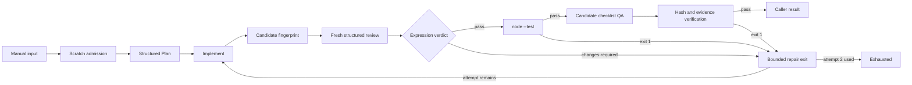

# First local AIDLC trial

[codex-first.loop.json](codex-first.loop.json) is a portable loop export tested against the owner's running instance. It performs one task in an independent disposable Node repository:



Plan and implementation status decisions also stop blocked work. The retry handoff renders the original Plan, latest review, gate output and evidence-check feedback explicitly; each worker has a fresh session. The full definition includes every route.

## Workspace and input

Workers operate only in a physical scratch repository below the API process's temp directory, `gg-aidlc-trial/<timestamp>/`. Create separate directories for positive and negative experiments. No dependencies are required. Before starting, provide:

- `package.json` with `type: "module"` and `scripts.test: "node --test"`.
- `clamp.js`, initially exporting `clamp(value, min, max)` as `Math.min(max, Math.max(min, value))`.
- `clamp.test.js` using `node:test` and `node:assert/strict`, covering valid ranges and equal bounds.
- `aidlc-trial-checklist.lock.json`, containing exactly the checklist array below, marked read-only after creation.
- A local `AGENTS.md` restricting work to this scratch directory, forbidding remote tools, subagents, Git mutations and checklist changes, and allowing QA writes only under `.graphgoblin-trial/`.
- An independent `git init` and one baseline commit. Do not use a linked worktree, symlinks, junctions or dependencies from another checkout.

The admission script checks the real workspace path, independent `.git` directory, absence of links, nonempty unique checklist ids and equality with the locked file before a worker starts. It does not create the directory. Candidate fingerprints include source, tests and the locked file; they exclude `.git`, `node_modules` and `.graphgoblin-trial`. The snapshot also verifies that the planner preserved the checklist. The final check requires an unchanged candidate, matching checklist and review hashes, a passing result for every required id, and nonempty workspace-local proof whose SHA-256 matches the QA output.

Use this run body, substituting the actual scratch directory:

```json
{
  "triggerNodeId": "start",
  "input": {
    "message": "Implement one task: clamp must throw RangeError with exact message min must not exceed max when min > max. Add a regression test, preserve valid ranges and equal bounds, and run node --test.",
    "workspacePath": "C:\\Users\\OWNER\\AppData\\Local\\Temp\\gg-aidlc-trial\\TIMESTAMP\\aidlc-trial-positive",
    "checklist": [
      {
        "id": "aidlc-trial-valid",
        "system": "clamp",
        "scenario": "Values inside and outside a valid range",
        "polarity": "positive",
        "steps": [
          "node --test",
          "Check clamp(5, 0, 10) = 5, clamp(-2, 0, 10) = 0 and clamp(12, 0, 10) = 10"
        ],
        "expected": "Valid ranges retain ordinary clamping behavior"
      },
      {
        "id": "aidlc-trial-invalid",
        "system": "clamp",
        "scenario": "Reversed range is rejected",
        "polarity": "negative",
        "steps": [
          "node --test",
          "Check clamp(5, 10, 0) throws RangeError with message min must not exceed max"
        ],
        "expected": "RangeError with exact message min must not exceed max"
      },
      {
        "id": "aidlc-trial-equal",
        "system": "clamp",
        "scenario": "Equal bounds",
        "polarity": "positive",
        "steps": ["node --test", "Check clamp(5, 3, 3) = 3"],
        "expected": "Equal bounds are valid and return the bound"
      }
    ]
  }
}
```

The task and checklist are caller inputs. Roles are node configuration, with literal model ids and efforts verified against `/model-catalog`; GraphGoblin itself gains no AIDLC-specific behavior. The schema collection preserves the full-design schemas and adds `LocalImplementation`, `LocalReview` and `CandidateQa` for the smaller trial outputs. `Plan` is the full-design Plan schema. These are shape checks; scripts verify the associated local facts.

## Import, publish and run

From this repository in PowerShell, with an already running API:

```powershell
$base = 'http://127.0.0.1:4747'
Invoke-RestMethod "$base/system/preflight"
Invoke-RestMethod "$base/harness/preflight"
Invoke-RestMethod "$base/model-catalog"
$export = Get-Content examples/aidlc/codex-first.loop.json -Raw
$created = Invoke-RestMethod "$base/loops/import" -Method Post -ContentType 'application/json' -Body $export
$loopId = $created.loop.id
$definition = ($export | ConvertFrom-Json).loop
$validation = Invoke-RestMethod "$base/loops/$loopId/validate" -Method Post -ContentType 'application/json' -Body (@{definition=$definition} | ConvertTo-Json -Depth 100)
$created.issues
$validation
Invoke-RestMethod "$base/loops/$loopId"
Invoke-RestMethod "$base/loops/$loopId/publish" -Method Post -ContentType 'application/json' -Body '{}'
# Save the complete run body above as aidlc-trial-input.json, with your real path.
$started = Invoke-RestMethod "$base/loops/$loopId/runs" -Method Post -ContentType 'application/json' -Body (Get-Content aidlc-trial-input.json -Raw)
$runId = $started.run.id
Invoke-RestMethod "$base/runs/$runId"
Invoke-RestMethod "$base/runs/$runId/events?after=0&limit=1000"
Invoke-RestMethod "$base/runs/$runId/thread"
Invoke-RestMethod "$base/runs/$runId/sessions"
# Transcript artifacts are listed in thread.artifacts:
# GET /runs/{runId}/artifacts/{artifactId}
```

Resolve every error before publishing or running; inspect warnings rather than assuming catalog membership is enforced at execution. Importing again creates another loop, so use the existing loop's draft route when updating it. This local example uses no API key. Authenticated installations require a bearer header without logging its value. The validation route is `/loops/{id}/validate`, not `/loops/validate`.

## Bounds and outcomes

The first-trial bounds remain: one task, one manually started run at a time, one worker at a time within that run, two implementation attempts (`maxIterations: 2`), one schema-repair turn per inference with `onFailure: "fail-run"`, ten-minute inference deadlines, a two-minute gate and thirty-second helper scripts. QA may rerun once through the second implementation attempt. No automatic triggers or children are configured. Global/per-loop concurrency and subscription budgets are not enforced by this definition: the operator must keep invocations sequential and count starts, including schema repair turns.

Planner/implementer use `gpt-6.1-sol/high`, reviewer `gpt-6-astra/high`, and QA `gpt-6-luna/high`. Planner/reviewer are read-only; implementer/QA use workspace-write. Every node uses approval never, network and web search false. Raw config overrides disable `features.multi_agent` and the currently configured `mcp_servers.node_repl`; another installation must disable its own MCP servers explicitly. Capability names do not currently establish a tool isolation profile. Admission is a path guard, not a general enforced read boundary for hostile workers.

Successful work returns `candidate-qa-passed` with scope `local-candidate-only`. Blocked work exits with failure. Repeated changes-required, gate exit 1 or failed evidence verification reaches `exhausted` after attempt 2, with the latest available feedback; no third implementation starts. Unexpected script failures or exhausted schema repair fail the run under the engine's typed failure rules.

For the negative experiment, seed the reversed-range regression in the baseline so `node --test` fails. Request only a comment change, explicitly prohibit executable/test changes in both attempts, ask the planner for that one ready experimental task and require honest review against the locked checklist. This deliberately leaves the defect present. The reviewer should return changes-required twice; the second retry exit should exhaust. Do not claim that exhaustion repaired the task.

## What comes next

This proves local structured handoffs, fresh same-family review, deterministic gates, candidate checklist evidence and bounded repair. It has no GitHub operations, PR approval, merge, post-merge QA or issue closure. The opposite-family rule is explicitly relaxed; two fresh Codex models are the same provider family.

The research design splits the full lifecycle into parent orchestration, planning/routing, implementation, review/dispositions, PR/CI, QA and closing/rework loops. Progress toward that design requires generic settings expansion, admission/claim helpers, supported alternate harnesses and verified model-family bindings, eligible separate GitHub identities, exact-head CI/approval checks, bounded merge observation, immutable merge/checklist proof and QA-before-closure. Test those stages in an explicitly authorized disposable remote repository. Strict evidence-only auditing requires a demonstrated read boundary. See [trial-report.md](trial-report.md) for the actual trial evidence and remaining gaps.
